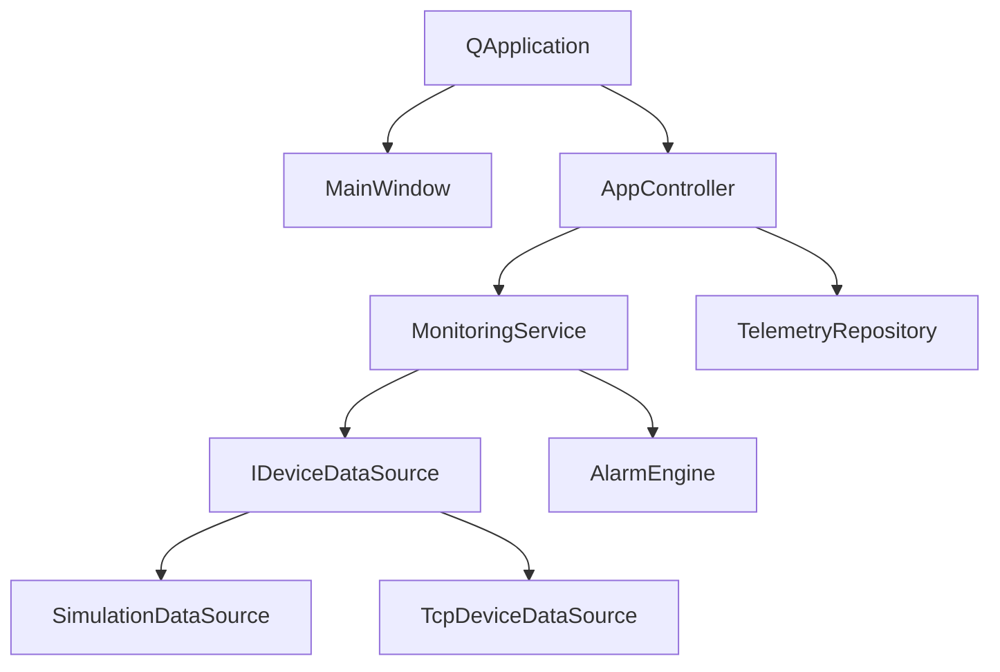
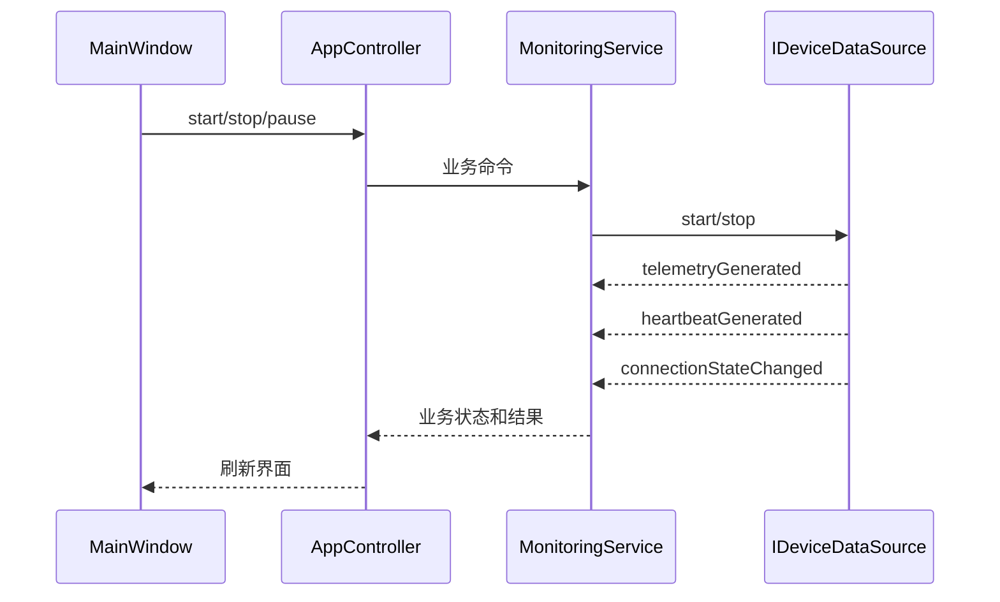
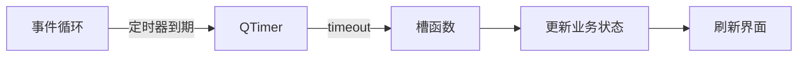
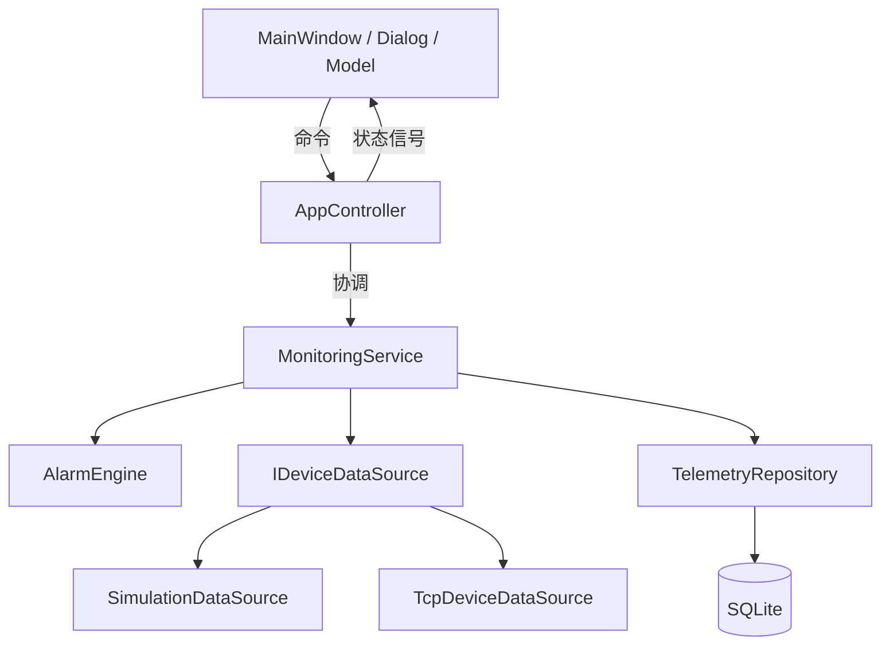
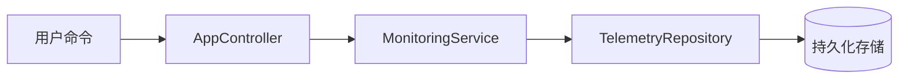

# Mu-Monitor 学习与问题记录

> 本文件包含从零学习路线、后端到 Qt 的概念对照、结构图、学习进度和问题记录。

> 本文件属于本地学习资料，不进入功能提交。

---

## 学习路线

###  Mu-Monitor 技术学习路线

> 本路线和 `TODOLIST.md` 对齐。  
> 2026-10-15 是目标日期，不是硬截止日期。  
> 学习目标是能够解释设计、阅读代码、运行测试并独立修改，而不是只完成功能。
>
>

---

####  使用方法

每个学习单元按照同一流程执行：

```text
先理解概念
-> 阅读对应文件
-> 运行或编写测试
-> 自己做一个小修改
-> 用自己的话解释
-> 再进入下一个单元
```

不要一次性阅读整个项目。每次只学习一个主题，追踪一条数据流。

---

###  L0：C++ 与 CMake 基础

####  学习目标

理解一个 Qt C++ 项目如何组织、编译和测试。

####  核心知识

- 头文件 `.h` 与实现文件 `.cpp` 的职责。
- `#pragma once` 和重复包含保护。
- 值类型、引用、常量引用和对象复制。
- `const` 成员函数。
- `enum class` 和普通枚举的区别。
- RAII：资源在对象构造时获取、析构时释放。
- 栈对象和堆对象。
- `new` 创建对象后的所有权。
- Qt 父子对象为什么可以自动释放子对象。
- 编译、链接和运行时的区别。
- 静态库和可执行目标。

####  对应文件

```text
CMakeLists.txt
src/core/*.h
src/core/*.cpp
tests/CMakeLists.txt
```

####  动手任务

- 找到 `TelemetrySample` 的声明和实现。
- 增加一个无副作用的校验函数。
- 为它写一个 QtTest。
- 执行 Debug 构建和测试。
- 解释“未定义引用”和“编译错误”的区别。

####  验收问题

- 为什么头文件里通常只放声明？
- 为什么成员函数可以加 `const`？
- 什么情况下需要智能指针？
- Qt 父子对象和 `std::unique_ptr` 解决的是不是同一问题？

---

###  L1：Qt 对象模型、信号槽和定时器

####  学习目标

掌握 Qt 最重要的事件驱动编程方式。

####  核心知识

- `QObject` 的对象树。
- `parent` 与子对象生命周期。
- signal 和 slot。
- `connect` 的连接类型。
- `Qt::AutoConnection`、`Qt::DirectConnection` 和 `Qt::QueuedConnection`。
- lambda 捕获中 `this` 的生命周期风险。
- `QTimer` 和事件循环。
- 定时器必须在拥有事件循环的线程中工作。
- `deleteLater()` 和直接 `delete` 的区别。

####  对应文件

```text
src/ui/mainwindow.*
src/network/SimulationDataSource.*
src/network/TcpConnectionWorker.*
src/app/MonitoringService.*
src/app/AppController.*
```

####  动手任务

- 画出 MainWindow 到 MonitoringService 的信号流。
- 增加一个状态变化信号并连接测试。
- 验证停止后定时器不会继续触发。
- 使用 `QSignalSpy` 检查信号次数。

####  验收问题

- 信号槽比直接函数调用多解决了什么问题？
- 为什么关闭窗口后仍可能有定时器继续运行？
- 跨线程信号默认使用什么连接方式？
- 为什么 Worker 对象不能属于错误线程？

---

###  L2：应用分层和职责边界

####  学习目标

理解什么是可维护的架构，而不是把所有逻辑写进 MainWindow。

####  核心知识

- UI、Application、Domain、Infrastructure 的职责。
- 依赖方向和依赖倒置。
- 接口隔离。
- 组合根和依赖装配。
- 领域对象和 UI 字符串的区别。
- Controller 只协调，不生成数据。
- Service 管业务，不做界面。
- Repository 管存储，不判断告警。
- DataSource 管设备数据来源，不管 UI。

####  目标依赖

```text
MainWindow
-> AppController
-> MonitoringService
-> IDeviceDataSource
```

####  对应文件

```text
src/app/AppController.*
src/app/MonitoringService.*
src/network/IDeviceDataSource.h
src/network/SimulationDataSource.*
src/ui/mainwindow.*
```

####  动手任务

- 在 MainWindow 中搜索 `QRandomGenerator` 和业务 QTimer。
- 把其中一个状态字段移到 MonitoringService。
- 绘制重构前后的依赖图。
- 更换数据源时确认 UI 不需要修改。

####  验收问题

- 为什么 UI 不应该直接访问 SQLite？
- Controller 和 Service 的区别是什么？
- 为什么接口应该由高层定义？
- 如果 SimulationDataSource 换成 TcpDeviceDataSource，哪些文件不应变化？

---

###  L3：TCP 字节流、协议帧和 CRC

####  学习目标

能够独立解释和实现 TCP 粘包、拆包和帧校验。

####  核心知识

- TCP 是连续字节流，不保留消息边界。
- 一次 `readyRead()` 可能包含半帧、一帧或多帧。
- 帧头 Magic 的作用。
- 版本和消息类型。
- 长度字段为什么是协议核心。
- 序号和重复帧。
- UTC 时间戳。
- 主机字节序与网络字节序。
- CRC16 校验范围。
- 最大帧长度限制。
- 增量解析和内部缓冲区。
- 错误帧后如何重新同步。

####  目标协议

```text
Magic
-> Version
-> MessageType
-> PayloadLength
-> Sequence
-> DeviceId
-> Timestamp
-> Payload
-> CRC16
```

####  对应文件

```text
src/protocol/Protocol.*
src/protocol/Frame.*
src/protocol/FrameCodec.*
src/protocol/CRC16.*
src/network/FrameDecoder.*
tests/ProtocolCodecTest.cpp
docs/protocol.md
```

####  动手任务

- 手工编码一帧并计算 CRC。
- 把一帧拆成三次喂给 FrameDecoder。
- 把三帧拼在一起交给 FrameDecoder。
- 修改一个字节验证坏 CRC。
- 画出解码状态循环。

####  验收问题

- TCP 为什么会粘包和拆包？
- 只有 CRC 没有长度字段可以吗？
- 长度字段为什么必须限制最大值？
- 收到坏帧后为什么不能直接丢掉全部缓冲区？

---

###  L4：Qt 线程和连接生命周期

####  学习目标

掌握 Socket 所在线程、对象移动、重连和资源释放。

####  核心知识

- GUI 线程与事件循环。
- `QThread` 和 `moveToThread()`。
- QObject 的线程归属不能随意修改。
- `QTcpSocket` 为什么要在所属线程操作。
- queued connection 的线程边界。
- 连接状态机。
- 连接超时、读写超时和心跳超时。
- 指数退避。
- 随机抖动避免重连风暴。
- 主动断开和网络异常断开的区别。
- 停止线程时如何安全释放资源。

####  状态机

```text
Disconnected
-> Connecting
-> Connected
-> Reconnecting
-> Connecting
```

####  对应文件

```text
src/network/TcpConnectionWorker.*
src/network/TcpDeviceDataSource.*
tests/TcpDeviceDataSourceTest.cpp
tools/DeviceSimulator/**
```

####  动手任务

- 停止模拟器，观察连接状态变化。
- 记录重连时间。
- 修改退避参数并说明影响。
- 主动关闭客户端，确认 Worker 正常退出。
- 使用 AddressSanitizer 或调试器检查对象生命周期。

####  验收问题

- 为什么 `QThread` 对象本身不一定运行在线程里？
- 为什么不能从 GUI 线程直接调用 Socket 阻塞读取？
- 固定重连间隔会有什么问题？
- 应用退出时如何避免 Socket 和 Worker 泄漏？

---

###  L5：SQLite 持久化与数据保护

####  学习目标

理解数据库连接、事务、迁移、备份和长期数据安全。

####  核心知识

- SQLite 和普通服务器数据库的区别。
- `QSqlDatabase` 的线程归属。
- 一个连接只在一个线程使用。
- prepared statement 和 SQL 注入。
- 事务和批量写入。
- WAL、`busy_timeout` 和 `synchronous`。
- 索引与查询计划。
- schema version 和 migration。
- 迁移前备份。
- `quick_check` 和数据损坏处理。
- 标准模式与便携模式的数据目录。
- 旧数据库复制迁移。
- 自动清理与历史数据保留。

####  目录策略

```text
--data-dir
-> MU_MONITOR_DATA_DIR
-> portable.flag
-> AppLocalDataLocation
```

####  对应文件

```text
src/database/DataDirectory.*
src/database/DatabaseManager.*
src/database/*Repository.*
tests/DataDirectoryTest.cpp
tests/DatabaseManagerTest.cpp
docs/DATABASE_DESIGN.md
```

####  动手任务

- 删除临时数据库，观察自动初始化。
- 制造 schema 变化，验证迁移前备份。
- 开启 WAL 并观察 `.db-wal` 文件。
- 执行按设备和时间范围查询。
- 测试目录只读和数据库损坏场景。

####  验收问题

- 为什么数据库连接不能跨线程复用？
- 为什么一条数据一次提交事务性能差？
- 为什么自增主键不是设备 ID？
- 为什么迁移失败不能直接删除数据库重来？

---

###  L6：用户、认证、角色和审计

####  学习目标

理解一个本地桌面系统的完整用户管理设计。

####  核心知识

- 用户、认证、授权和审计的区别。
- 密码不能明文保存。
- 盐和 PBKDF2 的作用。
- 密码算法版本和参数升级。
- 角色和权限的映射。
- 最后一个管理员保护。
- 当前用户不能禁用自己。
- 修改密码后撤销其他会话。
- 登录失败锁定。
- QSettings 中保存令牌的风险。
- 危险操作审计。

####  角色模型

```text
admin
operator
viewer
```

####  对应文件

```text
src/auth/PasswordService.*
src/auth/AuthenticationService.*
src/auth/UserManagementService.*
src/auth/AuditRepository.*
src/database/UserRepository.*
src/ui/UserManagementDialog.*
docs/DATABASE_DESIGN.md
```

####  动手任务

- 创建 operator 用户并验证权限。
- 禁用用户后验证不能登录。
- 尝试禁用最后一个管理员。
- 修改密码后验证旧会话被撤销。
- 检查审计日志是否记录关键操作。

####  验收问题

- 哈希和加密有什么区别？
- 为什么每个用户需要独立盐？
- 角色和权限为什么要分开？
- 审计日志为什么不记录密码和原始令牌？

---

###  L7：告警引擎和真实数据 UI

####  学习目标

把界面消息升级为可确认、可恢复的领域事件。

####  核心知识

- 阈值规则。
- 持续时间过滤。
- 上升沿和下降沿。
- 回差和抖动过滤。
- 去重。
- 告警状态机。
- 告警确认和恢复的区别。
- 告警事件持久化。
- Model/View 刷新策略。
- UI 刷新节流。
- 历史数据分页。

####  告警状态

```text
Normal
-> Active
-> Acknowledged
-> Cleared
-> Normal
```

####  对应文件

```text
src/alarm/**
src/app/MonitoringService.*
src/ui/mainwindow.*
src/ui/TelemetryTableModel.*
tests/AlarmEngineTest.cpp
```

####  动手任务

- 注入一次高温并观察状态转换。
- 重复注入故障，确认不会产生重复事件。
- 确认告警并关闭故障。
- 查询数据库中的告警事件。

####  验收问题

- 为什么告警不能用每个采样周期一条日志表示？
- 回差和持续时间分别解决什么问题？
- 告警确认是否等于告警恢复？

---

###  L8：测试、性能和发布

####  学习目标

证明程序在正常和异常情况下都可以稳定运行。

####  核心知识

- 单元测试、集成测试和端到端测试。
- 测试替身。
- 固定时间和随机种子。
- 故障注入。
- 日志分级和滚动。
- CPU、内存、队列和数据库增长指标。
- 长时间稳定性测试。
- `windeployqt`。
- 发布包和数据库升级。

####  对应命令

```powershell
.\scripts\check.ps1 -Configuration Debug
.\scripts\check.ps1 -Configuration Release
```

####  动手任务

- 运行全部测试。
- 关闭模拟器并检查重连。
- 注入坏 CRC 并检查统计。
- 连续运行 2 小时。
- 记录内存和数据库增长。
- 从干净目录启动便携版本。

####  验收问题

- 为什么测试不应依赖真实等待时间？
- 为什么最终还要做人工和集成验收？
- 如何证明 UI 没有被网络和数据库阻塞？
- 如何验证升级不会丢失历史数据？

---

###  推荐学习顺序

```text
L0 C++ 和 CMake
-> L1 QObject、信号槽和定时器
-> L2 应用分层
-> L3 TCP 和协议
-> L4 线程和连接生命周期
-> L5 SQLite
-> L6 用户和权限
-> L7 告警和 UI
-> L8 测试、性能和发布
```

每完成一个 L 单元，都应能做到：

```text
能读懂相关代码
能运行相关测试
能解释关键设计
能自己修改一个小功能
能说明失败场景
```

---

## 后端开发者的 Qt 对照

###  后端开发者的 Qt 学习对照

####  1. 先建立一个最接近的类比

可以把一个 Qt 桌面程序理解成：

```text
Qt Application
= 应用运行时
+ 进程内事件总线
+ 定时任务调度器
+ 对象生命周期容器
+ UI 事件循环
+ 网络和数据库基础库
```

它不是 Web 后端，但它同样有：

- 分层
- 服务
- 事件
- 定时任务
- 并发
- 数据访问
- 生命周期管理

---

####  2. 概念对照表

| 后端概念 | Qt 概念 | 说明 |
|---|---|---|
| Spring Bean / component | QObject 子类 | Qt 提供生命周期、信号槽和线程归属 |
| Spring Event / ApplicationEvent | signal | 进程内事件发布 |
| @EventListener | slot | 事件接收函数 |
| 同步事件监听 | DirectConnection | 发送者线程立即执行 |
| 异步消息/队列 | QueuedConnection | 事件进入接收者线程队列 |
| Node.js event loop | QApplication event loop | 分发输入、网络、定时器事件 |
| ScheduledExecutorService | QTimer | 在事件循环中执行定时任务 |
| DI 容器管理的 scope | QObject 父子关系 | 父对象负责子对象销毁 |
| Actor / thread-confined component | QObject thread affinity | 对象绑定到一个线程 |
| Controller | MainWindow / Widget | 桌面表现层和用户交互入口 |
| Application Service | AppController | 协调用例和模块 |
| Domain Service | MonitoringService | 持有业务状态和执行业务规则 |
| Port / interface | IDeviceDataSource | 业务层依赖的抽象边界 |
| Adapter / Integration Client | SimulationDataSource、TcpDeviceDataSource | 实现具体数据来源 |
| Repository / DAO | TelemetryRepository | 持久化和查询 |
| JPA / JDBC Connection | QSqlDatabase | 有线程归属，不能跨线程复用 |
| DTO / Projection | TelemetrySample、TelemetryRecord | 业务数据模型 |
| ViewModel | QAbstractTableModel | 把数据适配给 Qt View |
| Maven / Gradle | CMake | 配置构建目标和依赖 |
| Annotation Processor | MOC | 生成 Qt 元对象和信号槽代码 |

---

####  3. Qt 与后端最重要的区别

#####  3.1 signal 默认是进程内同步调用

后端事件通常通过消息队列异步传输。

Qt 的 signal：

- 不是 Kafka。
- 不是 RabbitMQ。
- 不是 HTTP。
- 默认可以是同步调用。
- 不跨进程。
- 生命周期与 QObject 绑定。

可以理解为：

```text
ApplicationEventPublisher
+ 类型安全的 Listener
+ 可跨线程投递
```

#####  3.2 QObject 有线程归属

后端线程池里的任务通常没有对象线程归属。

QObject 不同：

```text
一个 QObject 属于一个线程
槽函数通常在该线程执行
不能从其他线程随便直接调用对象方法
```

这类似：

- Actor 模型
- 线程封闭对象
- JDBC Connection
- 有状态请求处理器

#####  3.3 QTimer 依赖事件循环

QTimer 类似：

```text
ScheduledExecutorService
```

但不能直接运行在任意线程。

它要求线程有事件循环，并且定时任务执行时间必须短。

如果定时器槽阻塞：

- 该线程所有事件都会延迟。
- UI 会卡死。
- 网络消息会积压。
- 其他定时器不能准时触发。

#####  3.4 Qt Widgets 是表现层，不是后端控制器

`MainWindow` 更接近：

```text
桌面 View
+ View Controller
+ 用户输入入口
```

它应该调用应用服务，而不是：

- 打开数据库
- 创建 Socket
- 生成业务数据
- 判断告警
- 执行定时采集

---

####  4. L1 的后端类比

#####  QObject

```text
后端：Spring Bean
Qt：QObject
```

区别：

- QObject 不一定由 DI 容器创建。
- QObject 有父子生命周期。
- QObject 可以发送信号。
- QObject 有线程归属。

#####  父子对象

```text
后端：父 Scope 管理的资源
Qt：parent-child ownership
```

父对象销毁：

```text
自动 Dispose 所有子对象
```

适合：

- UI 组件树
- 控制器内部服务
- Worker 和其 Socket/Timer

不适合：

- 把业务服务挂到窗口下
- 把多个服务共享对象挂到某一个服务下
- 循环持有父子关系

#####  signal/slot

```text
后端：EventPublisher + EventListener
Qt：signal + slot
```

数据流：

```text
生产者
-> signal
-> 监听者
-> slot
```

好处：

```text
生产者不知道监听者
监听者可以替换
连接可以动态建立和断开
```

#####  DirectConnection

```text
后端：同步 Listener
Qt：DirectConnection
```

特点：

- 同线程直接调用。
- 槽阻塞发送者。
- 适合短逻辑。
- 跨线程直接使用有风险。

#####  QueuedConnection

```text
后端：线程池任务队列
Qt：QueuedConnection
```

特点：

- 信号进入接收者线程事件队列。
- 接收者事件循环执行槽。
- 不阻塞发送者。
- 队列满时需要处理背压。

#####  QTimer

```text
后端：ScheduledExecutorService
Qt：QTimer
```

特点：

- 属于一个线程的事件循环。
- 可以单次或周期触发。
- 任务必须短。
- 对象销毁前应停止。

---

####  5. L2 的后端类比

#####  MainWindow

```text
后端：Controller / View
Qt：MainWindow
```

职责：

- 接收用户操作
- 展示状态
- 发出命令

不负责：

- SQL
- TCP
- 业务规则
- 数据生成

#####  AppController

```text
后端：Application Service / Use Case Coordinator
Qt：AppController
```

职责：

- 接收 UI 命令
- 调用业务服务
- 汇总状态
- 向 UI 转发
- 管理应用对象

不负责：

- 生成数据
- 解析协议
- 执行业务阈值
- 执行 SQL

#####  MonitoringService

```text
后端：Domain Service / State Machine
Qt：MonitoringService
```

职责：

- 管理连接和采集状态
- 处理遥测和心跳
- 维护设备状态
- 协调告警和存储

它是业务状态唯一权威来源。

#####  IDeviceDataSource

```text
后端：Port / Integration Interface
Qt：IDeviceDataSource
```

实现：

```text
SimulationDataSource
TcpDeviceDataSource
ModbusDeviceDataSource
MqttDeviceDataSource
```

业务层依赖接口，不依赖具体通信实现。

#####  TelemetryRepository

```text
后端：Repository / DAO
Qt：TelemetryRepository
```

负责：

- 批量写入
- 查询
- 事务
- 数据库迁移

不负责：

- 告警判断
- UI
- 协议解析

#####  AlarmEngine

```text
后端：Domain Rule Engine / State Machine
Qt：AlarmEngine
```

负责：

- 阈值
- 持续时间
- 回差
- 去重
- 告警确认和恢复

---

####  6. 用后端架构图理解 Mu-Monitor

```text
[Desktop Presentation]
MainWindow
    |
    v
[Application Service]
AppController
    |
    v
[Domain Service]
MonitoringService
    |
    +----------------+----------------+
    |                |                |
    v                v                v
AlarmEngine   IDeviceDataSource   TelemetryRepository
                     |                |
                     v                v
            Simulation/TCP/TCP     SQLite
```

命令流：

```text
MainWindow
-> AppController
-> MonitoringService
-> IDeviceDataSource
```

数据流：

```text
IDeviceDataSource
-> MonitoringService
-> AlarmEngine / TelemetryRepository
-> AppController
-> MainWindow
```

---

####  7. 你应该优先补的 Qt 知识

你已经会的后端知识不需要重学。

只需要重点补：

1. QObject 生命周期。
2. signal/slot。
3. DirectConnection 和 QueuedConnection。
4. QTimer 和事件循环。
5. QObject 线程归属。
6. CMake 与 MOC。
7. QAbstractTableModel。

推荐顺序：

```text
QObject
-> signal/slot
-> event loop
-> QTimer
-> thread affinity
-> QThread + moveToThread
-> Model/View
```

---

####  8. 最新的理解方式

不要这样想：

```text
Qt = 我不懂的新语言
```

应该这样理解：

```text
C++ = 语言
Qt = 运行时 + 事件系统 + 生命周期 + UI + 网络 + 数据库
```

你已有的后端知识仍然有效：

- Service 还是 Service。
- Repository 还是 Repository。
- Adapter 还是 Adapter。
- 事件还是事件。
- 线程隔离还是线程隔离。
- 分层和依赖方向仍然适用。

真正需要学习的只是 Qt 如何实现这些概念：

```text
QObject 管理生命周期
signal/slot 实现事件
QTimer 实现调度
QueuedConnection 实现跨线程投递
Model/View 实现桌面展示
```

---

## 学习图册

###  L1 与 L2 学习图册

> 实线表示调用或依赖。  
> 虚线表示信号、事件或状态通知。

---

###  L1：QObject、信号槽和 QTimer

####  1. QObject 对象树

```text
QApplication
├── MainWindow
│   ├── QTimer（仅用于 UI 刷新）
│   ├── Model
│   ├── View
│   └── Dialog
│
└── AppController
    ├── MonitoringService
    │   ├── AlarmEngine
    │   └── IDeviceDataSource
    │       └── SimulationDataSource / TcpDeviceDataSource
    └── Repository
```



要点：

- 父子关系决定默认生命周期。
- 业务对象不要挂到 `MainWindow` 下面。
- 一个对象只有一个父对象。
- 线程归属和父子关系是两个不同的概念。

---

####  2. 命令向下，数据向上

```text
用户操作
   |
   v
MainWindow
   | 命令
   v
AppController
   | 命令
   v
MonitoringService
   | 命令
   v
IDeviceDataSource

IDeviceDataSource
   | 遥测 / 心跳 / 状态
   v
MonitoringService
   | 业务状态 / 转换结果
   v
AppController
   | UI 状态
   v
MainWindow
```



---

####  3. 同线程连接

```text
发送者线程
   |
   | signal
   v
DirectConnection
   |
   | 立即执行
   v
接收者槽
```

特点：

- 槽在发送者线程执行。
- 执行顺序确定。
- 槽可能阻塞发送者。
- 跨线程使用时有线程错误风险。

---

####  4. 跨线程连接

```text
网络线程
   |
   | signal
   v
事件队列
   |
   | QueuedConnection
   v
GUI 线程事件循环
   |
   v
接收者槽
```

特点：

- 槽在接收者所属线程执行。
- 不直接操作其他线程对象。
- 依赖接收者事件循环。
- 队列可能积压。

---

####  5. QTimer 和事件循环

```text
QCoreApplication::exec()
        |
        v
+----------------------+
|   事件循环 / 队列     |
+----------+-----------+
           |
           | 定时器事件
           v
        QTimer
           |
           | timeout
           v
         槽函数
           |
           v
     更新状态或界面
```



要点：

- QTimer 不创建线程。
- QTimer 必须有事件循环。
- 定时器属于创建它的线程。
- 定时器槽不能长时间阻塞。
- 停止数据源时要停止所有业务定时器。

---

####  6. 对象销毁和延迟信号

```text
MainWindow 析构
      |
      +--> 断开来自 AppController 的信号
      |
      +--> 停止 AppController
                    |
                    +--> 停止 MonitoringService
                              |
                              +--> 停止 DataSource
                                        |
                                        +--> 停止 QTimer
```

如果顺序错误：

```text
窗口已销毁
-> 定时器继续触发
-> 信号访问已销毁对象
-> 崩溃
```

正确原则：

```text
先停止生产者
再断开连接
最后销毁接收者
```

---

###  L2：应用分层和职责边界

####  1. 目标分层

```text
+-------------------------------+
| Presentation / UI             |
| MainWindow、Dialog、Model      |
+---------------+---------------+
                |
                v
+-------------------------------+
| Application                   |
| AppController                 |
+---------------+---------------+
                |
                v
+-------------------------------+
| Domain / Service              |
| MonitoringService、AlarmEngine |
+----------+----------+---------+
           |          |
           v          v
+----------------+  +------------------+
| Data Source    |  | Repository       |
| Simulation/TCP |  | SQLite           |
+----------------+  +------------------+
```



---

####  2. 数据流

```text
SimulationDataSource / TcpDeviceDataSource
                    |
                    | TelemetrySample
                    | HeartbeatRecord
                    | ConnectionState
                    v
           MonitoringService
             |           |
             |           |
             v           v
        AlarmEngine   TelemetryRepository
             |           |
             |           v
             |         SQLite
             v
       AlarmEvent
             |
             v
        AppController
             |
             v
         MainWindow
```

---

####  3. 命令流

```text
MainWindow
    |
    | connect/start/stop/ack
    v
AppController
    |
    | 业务命令
    v
MonitoringService
    |
    +--> IDeviceDataSource::start/stop
    +--> AlarmEngine::acknowledge
    +--> Repository::query
```

---

####  4. 职责矩阵

| 模块 | 负责 | 不负责 |
|---|---|---|
| MainWindow | 展示、用户输入 | Socket、SQL、协议、告警规则 |
| AppController | 协调命令和状态 | 生成数据、解析协议、执行 SQL |
| MonitoringService | 连接、采集、设备业务状态 | Widget、Socket I/O、直接 SQL |
| IDeviceDataSource | 定义数据来源契约 | 数据库、UI |
| SimulationDataSource | 确定性模拟数据 | TCP、CRC、SQLite |
| TcpDeviceDataSource | 网络和连接状态 | UI、告警、数据库 |
| AlarmEngine | 告警规则和状态机 | Widget、Socket |
| TelemetryRepository | 数据持久化和查询 | 告警判断、UI |
| MainWindow Model | 把领域数据映射为界面显示 | 生成业务数据、连接数据库 |

---

####  5. 数据源切换

```text
                IDeviceDataSource
                       |
          +------------+------------+
          |                         |
          v                         v
SimulationDataSource      TcpDeviceDataSource
          |                         |
          +------------+------------+
                       |
                       v
              MonitoringService
                       |
                       v
                 AppController
                       |
                       v
                   MainWindow
```

切换数据源时：

```text
只替换 IDeviceDataSource 的实现
MonitoringService 不需要知道是模拟还是 TCP
AppController 不需要修改
MainWindow 不需要修改
```

---

####  6. Controller、Service、Repository 的区别

```text
用户命令
-> AppController：决定调用哪个服务
-> MonitoringService：决定业务上怎么做
-> Repository：决定数据怎么保存
```



- Controller 是协调者。
- Service 是业务决策者。
- Repository 是数据访问者。
- DataSource 是数据生产者。
- UI 是展示者。

---

####  7. 对象所有权

```text
MainWindow
└── 拥有的 UI 对象

AppController
├── MonitoringService
└── Repository 或服务引用

MonitoringService
└── IDeviceDataSource

SimulationDataSource
├── Sampling QTimer
└── Heartbeat QTimer

TcpDeviceDataSource
├── QThread
├── TcpConnectionWorker
└── QTcpSocket
```

所有权规则：

- 谁创建，谁负责默认生命周期。
- 跨模块对象优先通过接口和引用传递。
- 不让 Worker 线程对象隶属于 GUI 对象。
- 不在多个父对象之间共享所有权。
- 不把业务状态复制到每个 Widget。

---

####  8. 反例：耦合架构

```text
MainWindow
├── QRandomGenerator
├── QTimer
├── QTcpSocket
├── FrameDecoder
├── DatabaseManager
├── AlarmEngine
└── Widget 更新
```

问题：

- 无法单独测试。
- 无法替换数据源。
- 网络异常会卡界面。
- 数据库变化会影响 UI。
- 窗口销毁时业务状态丢失。
- 一个改动会触发大量回归测试。

---

####  9. 正确架构的判断标准

```text
MainWindow 只显示和发命令
AppController 只协调
MonitoringService 管业务状态
IDeviceDataSource 管数据来源
Repository 管持久化
AlarmEngine 管告警规则
```

如果更换模拟器和 TCP 不需要修改业务模块，
如果更换 SQLite 不需要修改控件，
如果告警状态机可以脱离 GUI 测试，
说明分层是有效的。

---

## 学习进度

###  Mu-Monitor 学习进度

> 每次只学习一个课程。完成内容阅读、代码观察、动手练习和验收问题后，才能把状态改为“已掌握”。

####  总进度

| 课程 | 主题 | 状态 |
|---|---|---|
| L0 | C++、编译流程和 CMake | 学习中 |
| L1 | QObject、信号槽和 QTimer | 未开始 |
| L2 | 应用分层和职责边界 | 未开始 |
| L3 | TCP、协议帧和 CRC | 未开始 |
| L4 | Qt 线程和连接生命周期 | 未开始 |
| L5 | SQLite 持久化和数据保护 | 未开始 |
| L6 | 用户、认证、角色和审计 | 未开始 |
| L7 | 告警引擎和真实数据 UI | 未开始 |
| L8 | 测试、性能和发布 | 未开始 |

####  L0：C++、编译流程和 CMake

#####  目标

理解一个 `.cpp` 文件如何经过编译和链接，最终成为 `Mu-Monitor.exe`。

#####  阅读文件

```text
CMakeLists.txt
src/main.cpp
src/core/TelemetryRecord.h
src/core/TelemetrySample.h
tests/TimeUtilsTest.cpp
```

#####  学习检查

- [ ] 能解释预处理、编译、链接三个阶段。
- [ ] 能解释 `.h` 和 `.cpp` 的区别。
- [ ] 能解释 CMake 的作用。
- [ ] 能解释目标、源文件和依赖库。
- [ ] 能解释 Qt Widgets、Sql、Network 模块的作用。
- [ ] 能说清 `main()` 做了哪些事。

#####  动手任务

- [ ] 找到 `QApplication` 的创建位置。
- [ ] 找到数据库初始化位置。
- [ ] 找到登录窗口和主窗口的创建位置。
- [ ] 执行一次 Debug 构建。
- [ ] 执行一次 `TimeUtilsTest`。
- [ ] 用自己的话说出构建成功后生成了哪些文件。

#####  验收问题

1. 为什么 `.h` 文件里通常不写函数实现？
2. 为什么源文件修改后不一定需要重新编译整个项目？
3. CMake 和编译器、链接器分别是什么关系？
4. 为什么 Qt 项目需要在 `main()` 中创建 `QApplication`？
5. `QApplication::exec()` 为什么不会立即返回？

---

## 问题记录

###  问题记录

> 本文件用于记录学习过程中提出的问题。  
> 每个问题只保留精简结论、核心原理、项目映射和记忆点。  
> 本文件属于本地学习资料，不进入功能提交。

####  记录格式

```text
日期：
问题：
简短结论：
核心原理：
项目对应：
需要记住：
```

---

####  2026-09-25

#####  问题

把各功能由函数调用改成异步队列，并解耦模块，是否意味着整个系统不会卡死？

#####  简短结论

方向正确，但不能保证系统永不卡死。

异步队列可以避免调用方等待慢操作，模块解耦可以降低依赖；真正避免 GUI 卡死还需要有界队列、背压、正确的线程划分和非阻塞 UI。

#####  核心原理

```text
同步调用：
调用方等待任务完成，慢操作会阻塞调用方。

异步队列：
调用方只提交任务并继续运行，工作线程稍后处理。

模块解耦：
模块之间通过接口、信号或队列通信，不直接依赖具体实现。
```

异步队列解决的是：

```text
调用方是否等待慢操作
```

模块解耦解决的是：

```text
模块之间是否互相依赖
```

两者是不同的目标。

#####  仍可能导致卡死的情况

- GUI 线程使用 `waitForFinished()` 等待异步结果。
- 队列满时调用方选择无限等待。
- GUI 线程获取了被工作线程长期占用的锁。
- 工作线程处理速度长期低于生产速度。
- Excel 导出、文件处理和图像处理仍在 GUI 线程执行。
- GUI 槽函数执行时间过长，阻塞事件循环。
- 队列无上限，最终耗尽内存。
- 队列有上限但没有背压和拒绝策略。

#####  项目对应

```text
GUI 线程：
MainWindow、AppController

网络线程：
TcpConnectionWorker、QTcpSocket、FrameDecoder

数据库线程：
SqliteTelemetryRepository、DatabaseWorker、SQLite

业务层：
MonitoringService、AlarmEngine
```

目标链路：

```text
TcpDeviceDataSourceAdapter
-> MonitoringService
-> 异步任务或信号
-> TelemetryRepository
-> 数据库线程
-> SQLite

数据库线程完成
-> 信号
-> AppController
-> MainWindow
```

当前项目已经具备：

- TCP 独立网络线程
- 异步遥测 Repository
- 有界队列和拒绝策略
- 数据库工作线程
- 独立告警引擎

尚未完成：

- Repository 注入 AppController
- TCP Adapter 接入 AppController
- AlarmEngine 接入 MonitoringService
- 端到端异步链路验证

#####  需要记住

```text
异步队列不是高性能的同义词。
解耦不等于异步。
异步不等于不会卡死。

异步只把等待从调用方转移到了工作线程和队列。

系统不卡死必须同时满足：

GUI 不做慢操作
+ 线程归属正确
+ 队列有上限
+ 有背压和错误处理
+ GUI 不阻塞等待结果
+ 工作线程吞吐量足够
+ 长时间和压力测试通过
```

#####  一句话总结

> 异步队列和解耦可以显著降低 GUI 卡死风险，但只有配合正确的线程模型、有界队列、背压和非阻塞 UI，才能保证系统具有较好的响应性。

---

